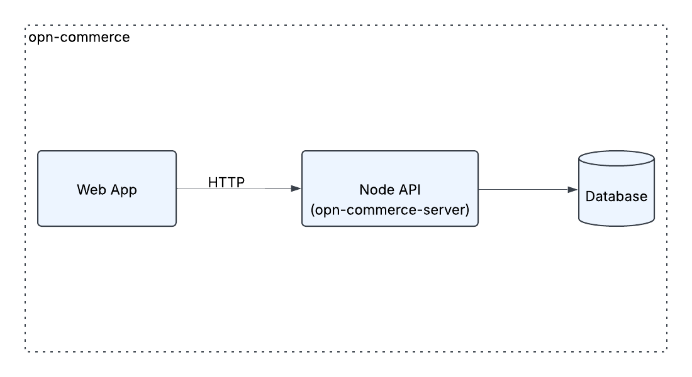

# opn-commerce-server

## 📌 Prerequisites

- **Node.js**: v20+
- **npm**: Installed with Node.js

## 🚀 Installation Steps

1.  git clone https://github.com/KyawThetKhing/opn-commerce-server
2.  npm install
3.  cp .env.example .env
4.  npm run start

## 🛠 Available Scripts

- **npm run dev** – Starts the application in development mode.
- **npm run start** – Starts the application in production mode.

## 🏗 System Overview

### Ideas To improve

- Writing unit tests
- Using JWT for authentication
- Encrypting sensitive data (password, token, etc.)
- Using rate limiting
- The current catch block return generic error messages, it should be more specific for production grade applications

## Challenge 1

Download Postman Collection and test api in postman [Download](./opn-commerce-server.postman_collection.json)

## Challenge 2

.png>)

## Challenge 3

Download Postman Collection and test api in postman [Download](./cart.postman_collection.json)
